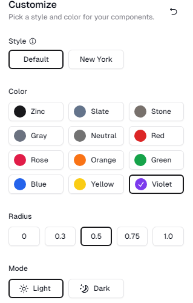

## Inciar servidor de desenvolvimento

```bash
npm run dev
# or
yarn dev
# or
pnpm dev
# or
bun dev
```

[Link do tutorial](https://www.youtube.com/watch?v=UnwmPuPdhFc&t=709s&ab_channel=JanMarshal)

## Tecnologias usadas

<p>React</p>
<p>Tailwind</p>
<p></p>

## [shadcn/ui](https://ui.shadcn.com/)

### [Após a instalção vem a escolha do tema](https://ui.shadcn.com/themes)



#### depois basta copiar o codigo do tema e substituir o tema padrão do shadcn no globals.css

[button shadcn](https://ui.shadcn.com/docs/components/button)

## comando fornecido pelo tutorial

```bash
npm i stripe use-shopping-cart next-sanity @stripe/stripe-js @sanity/image-url --force
```

## [sanity.io](https://www.sanity.io/docs/create-a-sanity-project)

```
npm create sanity@latest -- --template clean --create-project "ecommerce tutorial" --dataset production
```

### Após a instalação e configuração do sanity vá para pasta do sanity e inicie o servidor de desenvolvimento para adicionar produtos

```
cd sanity
```

```
npm run dev
```

### para conectar o sanity com o projeto na pasta app crie uma pasta lib/sanity.ts e em projectId cole o id do projeto usado

```bash
import { createClient } from "next-sanity"
import imageUrlBuilder from "@sanity/image-url"

export const client = createClient({
  projectId: "id do projeto usado para conectar",
  dataset: "production",
  apiVersion: "2022-03-25",
  useCdn: true,
})

const builder = imageUrlBuilder(client)

export function urlFor(source: any) {
  return builder.image(source)
}

```

### Em next.config.mjs adicione o comando para aparecer as imagens do sanity

```
 images: {
    domains: ["cdn.sanity.io"],
  },
```
